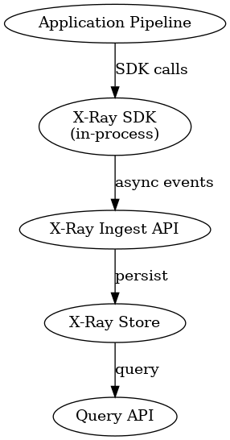

# ARCHITECTURE.md

## Overview
Multi-step, non-deterministic logic is becoming more and more important in modern algorithumic systems (LLMs, heuristics, ranking systems). Conventional logging and tracing only explain what happened, and not why that specific decision was made, when such systems generate inaccurate outputs.

X-Ray is intended to give these systems decision-level transparency. It allows developers to debug results by comprehending inputs, alternatives, constraints, and reasoning by capturing structured, queryable context at each logical decision stage in a pipeline.

The system is lightweight, safe to use in production settings, and purposefully general-purpose.

---

## Design Principles

### Choices Regarding Functions
Instead of function calls or service spans, X-Ray models **business decisions**. A logical decision point, like filtering, ranking, or selection, is represented by a step.

### Steps Are First-Class, Pipelines Are Opaque
Although pipelines differ greately between domains, decision steps are kinda common to all systems. To facilitate cross-pipeline analysis, X-Ray standardizes steps rather than pipelines.

### Fidelity vs. Queryability 
By default, X-Ray records metrics and summaries rather than complete raw data. Complete information is specifically opt-in and optional.

### Zero Impact on Core Logic
X-Ray must never interfere with the primary system's availability or accuracy. Every SDK operation is best-effort and asynchronous.

---

## System Architecture

### High-Level Flow



The SDK buffers events in memory and sends them asynchronously. Failures do not block pipeline execution.

---

## Data Model

### Entity Diagram

```
Run
 └── Step (1..n)
       └── Candidate (0..n)
```

---

### Run
Represents a single pipeline execution.

```json
{
  "runId": "uuid",
  "pipelineName": "competitor_selection",
  "pipelineVersion": "v1",
  "metadata": {
    "env": "prod" | "staging",
    "experimentId": "exp_42",
    "userId": "
  },
  "startedAt": 1710000000000,
  "completedAt": 1710000012000
}
```

**Rationale**
- Combines every step that is part of a single execution
- Permits reconstruction, comparision, and debugging

**Alternative Considered**
Flattening steps without a run boundary would make it impossible to reason about end-to-end decision paths or outcomes.

---

### Step
Represents a logical decision point within a run.

```json
{
  "stepId": "uuid",
  "runId": "uuid",
  "stepType": "filter", // "generation" | "ranking" | "select"
  "stepName": "price_filter",
  "inputsSummary": {
    "priceRange": "₹500–₹1500"
  },
  "metrics": {
    "inputCount": 5000,
    "outputCount": 30,
    "eliminationRate": 0.994,
    "durationMs": 120
  },
  "outcomeSummary": {
    "kept": 30
  }
}
```

**Reasons for this structure**
- `stepType` enables cross-pipeline querying
- `metrics` allow numeric filtering and aggregation
- Summaries provide explainability without large payloads

**If not, what would break?**
Unstructured logs or pipeline-specific schemas would make cross-pipeline queries impossible and require custom parsing per system.

---

### Candidate (Optional)
Represents an individual option evaluated within a step.

```json
{
  "candidateId": "sku_123",
  "stepId": "uuid",
  "attributes": {
    "title": "Laptop Stand Adjustable",
    "price": 999
  },
  "decision": "rejected",
  "reason": {
    "code": "CATEGORY_MISMATCH",
    "explanation": "Expected phone accessories"
  },
  "score": 0.12
}
```

Candidate-level data is optional and configurable to control performance and cost.

---

## Query Model

### Metric-Based Queries
Example:
**Show all runs where a filtering step eliminated more than 90% of candidates.**

It can be supported via standardized `stepType` and numeric metrics.

```sql
stepType = 'filter' AND metrics.eliminationRate > 0.9
```

---

### Run Reconstruction
To debug a bad output:
1. Retrieve all steps for a `runId`
2. Go through all steps in execution order
3. Review summaries and sampled candidates
4. Drill into full candidate data if it's available

---

## Debugging Walkthrough

A phone case and a laptop stand are mismatched in a competitor selection run.

Using X-Ray:
1. View the selected and top-ranked candidates by looking at the final `select` step.
2. Examine the inflated relevance scores in the `rank` step.
3. Examine the `filter` step and observe that how many candidates were eliminated.
4. Go back to `generate` step and look for terms like "stand" that an LLm introducted (LLM hallucination).

With the help of these step one can isolate the root cause to keyword generation rather than  other steps like filtering or ranking.

---

## Performance & Scale

Thousands of candidates can be handled by Steps. It might be too costly to record every candidate's complete details.

X-Ray supports capture levels:
- `summary`: metrics only (by default)
- `sample`: limited accepted/rejected examples
- `full`: all candidates and decisions

The capture level is specifically selected by the developer. Safe defaults are enforced by the system.

---

## Developer Experience

### Minimal Instrumentation

```js
const run = xray.startRun("competitor_selection");

const step = xray.startStep("price_filter", { stepType: "filter" });
const result = filter(candidates);
step.end({ inputCount: candidates.length, outputCount: result.length });

xray.endRun();
```

### Complete Instrumentation
Developers have the option to document decisions and justifications made at the candidate level.

### Backend Failure
SDK calls are always asynchronous. When an event fails, it is dropped and buffered. The pipeline is unaffected.

---

## Real-World Application

In a lead scoring system I previously worked on, leads were scored using multiple heuristic rules and feedback signals. When leads were unexpectedly classified as low quality and therefore had low scores, debugging required us to manually trace rule execution across services (different rules for meta/google based leads) and database states.

With X-Ray, each scoring rule could be recorded as a step, making it instantly evident which rule dominated the final score and the reasons behind the downgrading of particular leads.

---

## API Spec (Brief)

### POST /ingest/run
Request:
```json
{ "run": { ... } }
```

### POST /ingest/step
Request:
```json
{ "step": { ... }, "candidates": [] }
```

### GET /query/steps
Query Parameters:
- stepType
- minEliminationRate
- pipelineName

---

## What Next

Future work would involve the following if X-Ray were shipped for practical use:
- Schema versioning and migrations
- Sampling strategies for steps with a high volume
- Privacy controls and redaction
- Visualization UI
- Integration with or over tracing systems
